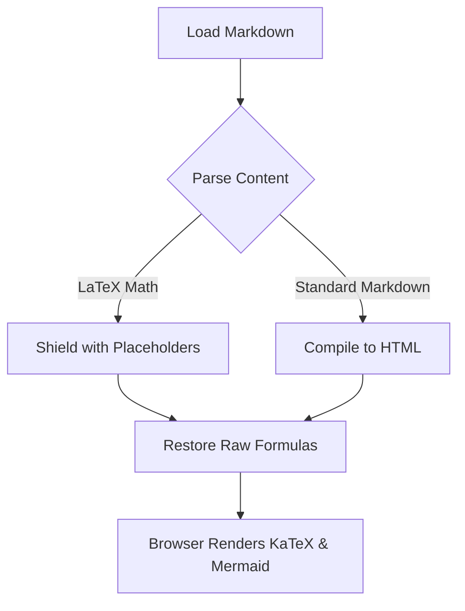

# Test Math and Diagram Rendering

This test file verifies the combined application's rendering capabilities for LaTeX math, Mermaid diagrams, tables, checklists, and code formatting in a single Markdown document.

## 1. LaTeX Math Equations

Here is an inline equation: $f(x) = \sigma(x) = \frac{1}{1 + e^{-x}}$ which represents the standard logistic sigmoid function.

Below is a display math equation block centered on the screen:

$$
\int_{-\infty}^{\infty} e^{-x^2} dx = \sqrt{\pi}
$$

An advanced piecewise function test:

$$
f(x) = \begin{cases}
\sqrt{x} & \text{if } x \geq 0 \\
-\sqrt{|x|} & \text{if } x < 0
\end{cases}
$$

## 2. Mermaid Diagram Layout

Here is an inline flowchart diagram rendering the document parsing lifecycle:



## 3. Lists and Checklist Status

- [x] Checkboxes and task items verified
- [x] LaTeX equations render beautifully
- [ ] Diagram styling validation

## 4. Component Comparison Table

| Component | Target Syntax | Library Provider | Output Format |
| :--- | :---: | :---: | :---: |
| **Math** | `$math$` / `$$math$$` | KaTeX (CDN) | High-Fidelity MathML |
| **Diagrams** | ` ```mermaid ` | Mermaid.js (CDN) | Interactive SVG |
| **Checklists** | `- [ ]` / `- [x]` | Python Preprocess | HTML Inputs |

## 5. Python Syntax Highlighting

Here is a block of Python code:

```python
def parse_markdown(file_path):
    """Reads a markdown file and compiles it to HTML."""
    try:
        with open(file_path, 'r', encoding='utf-8') as f:
            content = f.read()
        return content
    except OSError as e:
        print(f"Error opening file: {e}")
        return None
```

## 6. Footnotes and Disclosures

This application parses markdown files seamlessly[^1].

<details>
<summary>💡 Pro Reading Tips</summary>

* Use **Ctrl + E** to toggle the live editor pane next to your preview.
* Adjust typography spacing directly from the dropdown toolbar menus.
* Use standard Vim keys (**j**, **k**, **gg**, **G**) to navigate documents quickly.

</details>

[^1]: Verified using Synora Document Studio.
